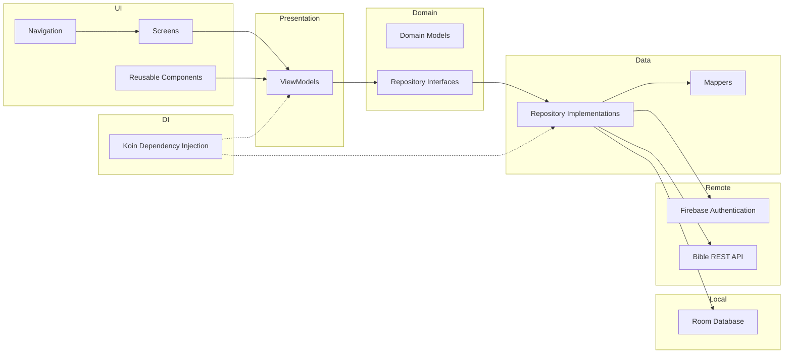

## Arquitetura

O projeto segue uma arquitetura baseada em **MVVM (Model-View-ViewModel)**, **Repository Pattern** e princípios da **Clean Architecture**, promovendo separação de responsabilidades, baixo acoplamento e maior facilidade para manutenção e testes.

As principais camadas da aplicação são:

- **UI:** telas e componentes desenvolvidos com Jetpack Compose.
- **Presentation:** ViewModels responsáveis pelo gerenciamento de estado e regras de apresentação.
- **Domain:** modelos de domínio e contratos (interfaces) dos repositórios.
- **Data:** implementações dos repositórios, mappers, persistência local e acesso remoto.
- **DI:** configuração da injeção de dependência utilizando Koin.
- **Navigation:** gerenciamento do fluxo de navegação da aplicação.

### Visão Geral da Arquitetura

