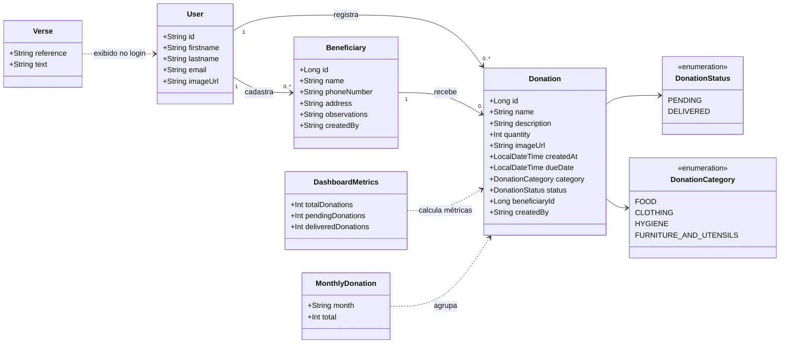

## Diagrama de Classes

O diagrama abaixo apresenta os principais modelos de domínio e seus relacionamentos.

```mermaid
classDiagram
direction LR

class User {
    +String id
    +String firstname
    +String lastname
    +String email
    +String imageUrl
}

class Beneficiary {
    +Long id
    +String name
    +String phoneNumber
    +String address
    +String observations
    +String createdBy
}

class Donation {
    +Long id
    +String name
    +String description
    +Int quantity
    +String imageUrl
    +LocalDateTime createdAt
    +LocalDateTime dueDate
    +DonationCategory category
    +DonationStatus status
    +Long beneficiaryId
    +String createdBy
}

class DashboardMetrics {
    +Int totalDonations
    +Int pendingDonations
    +Int deliveredDonations
}

class MonthlyDonation {
    +String month
    +Int total
}

class Verse {
    +String reference
    +String text
}

class DonationStatus {
    <<enumeration>>
    PENDING
    DELIVERED
}

class DonationCategory {
    <<enumeration>>
    FOOD
    CLOTHING
    HYGIENE
    FURNITURE_AND_UTENSILS
}

User "1" --> "0..*" Beneficiary : cadastra

User "1" --> "0..*" Donation : registra

Beneficiary "1" --> "0..*" Donation : recebe

Donation --> DonationStatus

Donation --> DonationCategory

DashboardMetrics ..> Donation : calcula métricas

MonthlyDonation ..> Donation : agrupa

Verse ..> User : exibido no login
```