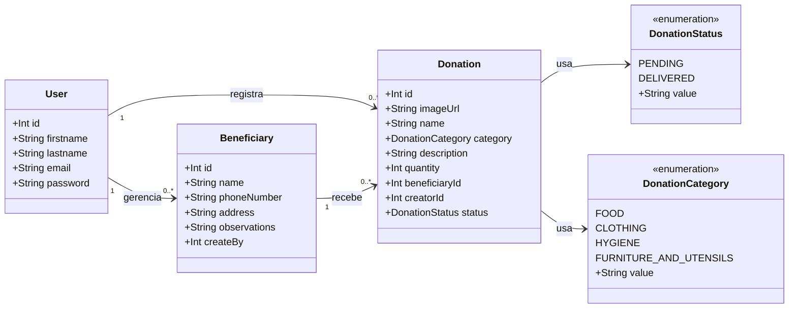

## Diagrama de classes

```mermaid
classDiagram
    direction LR

    class User {
        +Int id
        +String firstname
        +String lastname
        +String email
        +String password
    }

    class Donation {
        +Int id
        +String imageUrl
        +String name
        +DonationCategory category
        +String description
        +Int quantity
        +Int beneficiaryId
        +Int creatorId
        +DonationStatus status
    }

    class Beneficiary {
        +Int id
        +String name
        +String phoneNumber
        +String address
        +String observations
        +Int createBy
    }

    class DonationStatus {
        <<enumeration>>
        PENDING
        DELIVERED
        +String value
    }

    class DonationCategory {
        <<enumeration>>
        FOOD
        CLOTHING
        HYGIENE
        FURNITURE_AND_UTENSILS
        +String value
    }

    %% Relacionamentos e Vínculos
    User "1" --> "0..*" Beneficiary : gerencia
    User "1" --> "0..*" Donation : registra
    Beneficiary "1" --> "0..*" Donation : recebe
    Donation --> DonationStatus : usa
    Donation --> DonationCategory : usa
```