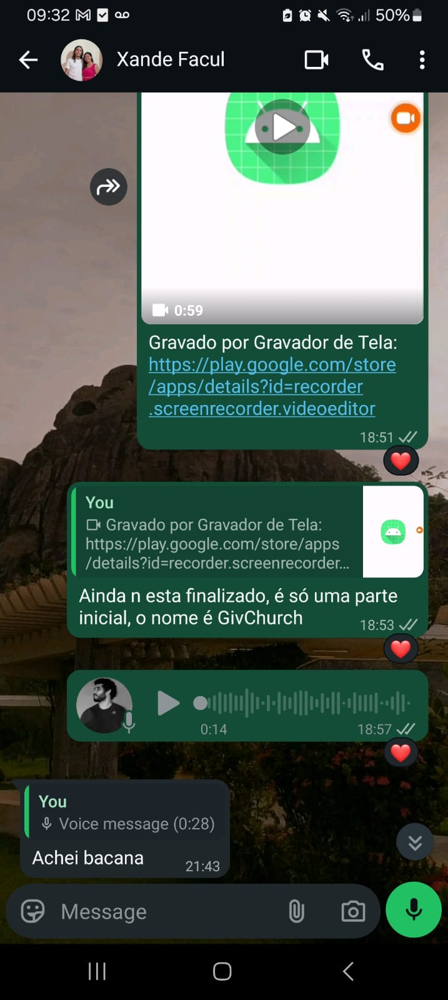
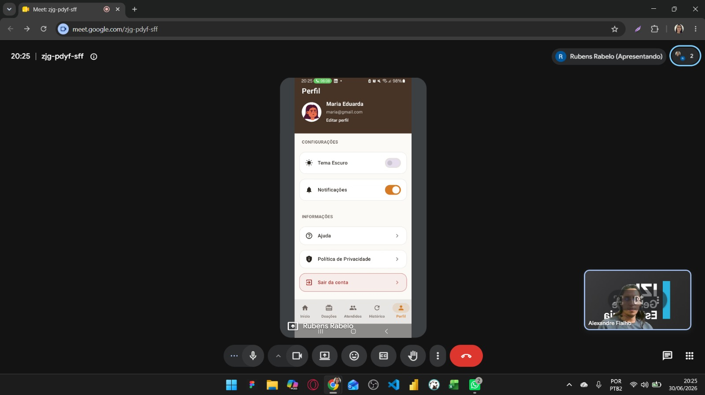
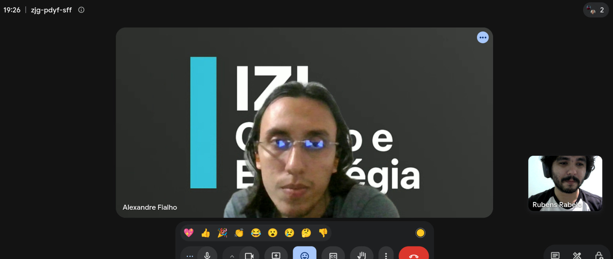
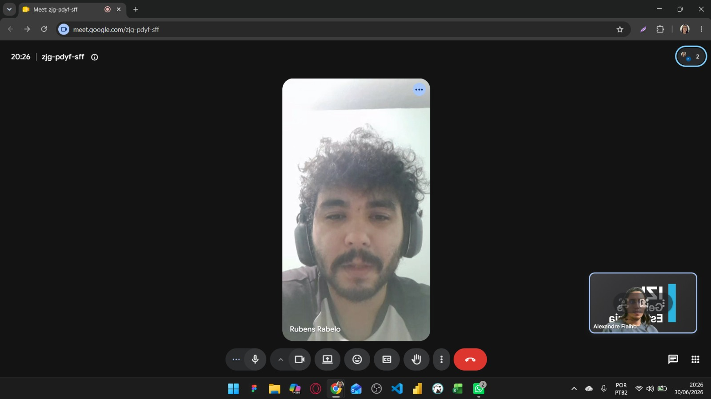

# Relatório de Desenvolvimento do Projeto

## Projeto: GivChurch – Sistema de Gestão de Doações

**Disciplina:** Desenvolvimento Mobile

**Aluno:** Rubens Rabêlo Soares

**Curso:** Sistemas de Informação

---

# 1. Introdução

Este relatório apresenta o desenvolvimento do projeto **GivChurch**, um aplicativo Android desenvolvido para auxiliar igrejas e organizações sociais no gerenciamento de doações e beneficiários.

O documento descreve o levantamento inicial dos requisitos realizado junto a um possível usuário da aplicação, o desenvolvimento da solução proposta, a apresentação da versão final do sistema e o feedback recebido após sua demonstração.

---

# Perfil do Usuário Consultado

O levantamento dos requisitos e a validação da aplicação foram realizados com **Alexandre Fialho**, jovem participante da liderança da Pastoral da Juventude da Igreja Católica. Alexandre participa de ações sociais e auxilia na organização e distribuição de doações, além de conviver com familiares e voluntários envolvidos nesse processo. Sua experiência contribuiu para a definição dos requisitos da aplicação, validação das funcionalidades implementadas e sugestão de melhorias para futuras versões do sistema.

---

# 2. Levantamento Inicial dos Requisitos

Antes do início do desenvolvimento, foi realizada uma conversa com um possível usuário da aplicação, participante de ações sociais promovidas por uma igreja.

Durante essa conversa foram discutidas as principais dificuldades encontradas no gerenciamento das doações e quais funcionalidades seriam importantes para facilitar esse processo.

Entre os requisitos levantados destacam-se:

- cadastro de beneficiários;
- cadastro de doações;
- associação entre beneficiários e doações;
- histórico das doações;
- controle das entregas;
- facilidade de utilização por voluntários.

Essas informações serviram como base para definir o escopo inicial do projeto.

## Figura 1 – Conversa inicial para levantamento dos requisitos

    

---

# 3. Desenvolvimento da Aplicação

Com base nos requisitos levantados, foi desenvolvido o aplicativo **GivChurch**, implementando funcionalidades voltadas para o gerenciamento completo das doações.

Durante o desenvolvimento foram implementados recursos como:

- autenticação utilizando Firebase Authentication;
- cadastro, edição e exclusão de beneficiários;
- cadastro, edição e exclusão de doações;
- seleção de imagens da galeria do dispositivo para usuários e doações;
- dashboard com métricas das doações;
- histórico de doações;
- gerenciamento do perfil do usuário;
- persistência local utilizando Room Database;
- consumo de API para exibição de versículos bíblicos;
- arquitetura baseada em MVVM, Repository Pattern e Clean Architecture;
- testes unitários para ViewModels, Repositories e Mappers.

Além da implementação funcional, todas as telas foram organizadas em módulos para facilitar a manutenção do projeto.

As telas desenvolvidas podem ser consultadas diretamente no código-fonte.

### Autenticação

- [Tela de Login](./app/src/main/java/com/example/givchurch/ui/screen/auth/LoginScreen.kt)
- [Tela de Registro](./app/src/main/java/com/example/givchurch/ui/screen/auth/RegisterScreen.kt)

### Página Inicial

- [Tela Inicial (Dashboard)](./app/src/main/java/com/example/givchurch/ui/screen/home/MainHomeScreen.kt)

### Beneficiários

- [Tela Principal de Beneficiários](./app/src/main/java/com/example/givchurch/ui/screen/beneficiary/MainBeneficiaryScreen.kt)
- [Tela de Cadastro de Beneficiário](./app/src/main/java/com/example/givchurch/ui/screen/beneficiary/AddBeneficiaryScreen.kt)

### Doações

- [Tela Principal de Doações](./app/src/main/java/com/example/givchurch/ui/screen/donation/MainDonationScreen.kt)
- [Tela de Cadastro de Doação](./app/src/main/java/com/example/givchurch/ui/screen/donation/AddDonationScreen.kt)
- [Tela de Detalhes da Doação](./app/src/main/java/com/example/givchurch/ui/screen/donation/DonationDetailScreen.kt)

### Histórico

- [Tela de Histórico](./app/src/main/java/com/example/givchurch/ui/screen/history/MainHistoryScreen.kt)

### Perfil

- [Tela de Perfil](./app/src/main/java/com/example/givchurch/ui/screen/profile/MainProfileScreen.kt)

---

## Figura 2 – Demonstração de algumas telas da aplicação

    

---

# 4. Apresentação da Versão Final

Após a conclusão do desenvolvimento, foi realizada uma reunião online com o mesmo usuário que participou da definição inicial dos requisitos.

Durante a apresentação foram demonstradas todas as funcionalidades implementadas na aplicação, incluindo:

- autenticação de usuários;
- gerenciamento de beneficiários;
- gerenciamento de doações;
- dashboard com indicadores;
- histórico das doações;
- gerenciamento do perfil;
- utilização de imagens da galeria para usuários e doações.

A reunião permitiu validar que as funcionalidades desenvolvidas atendiam ao objetivo inicialmente proposto.

## Figura 3 – Início da apresentação da versão final

    

---

# 5. Feedback do Cliente

Ao final da apresentação, o usuário avaliou positivamente o sistema desenvolvido.

Foram destacados como pontos positivos:

- interface organizada;
- facilidade de navegação;
- simplicidade para realizar os cadastros;
- organização das informações;
- praticidade no gerenciamento das doações.

O usuário informou que o sistema atende ao objetivo inicialmente discutido e aprovou a solução apresentada.

Durante a conversa também foi sugerida uma melhoria para futuras versões do aplicativo.

## Figura 4 – Aprovação do projeto e sugestão de melhoria

    

---

# 6. Sugestão de Evolução

Como proposta para uma futura evolução do sistema, foi sugerida a implementação de um módulo específico para **Campanhas Solidárias**.

A ideia consiste em permitir que a instituição possa criar campanhas de arrecadação com metas definidas, facilitando o acompanhamento do progresso de cada ação social.

Entre as funcionalidades sugeridas estão:

- criação de campanhas;
- definição de metas de arrecadação;
- acompanhamento da quantidade arrecadada;
- visualização do percentual de progresso;
- gerenciamento de campanhas ativas e encerradas.

Embora essa funcionalidade não faça parte da versão atual do projeto, a arquitetura adotada (MVVM + Repository Pattern + Clean Architecture) permite sua implementação futuramente sem alterações significativas na estrutura existente.

---

# 7. Considerações Finais

O desenvolvimento do projeto permitiu aplicar diversos conceitos estudados durante a disciplina, como arquitetura em camadas, persistência de dados, autenticação de usuários, consumo de APIs, injeção de dependência e testes automatizados.

A conversa inicial foi fundamental para compreender as necessidades do usuário e definir os requisitos da aplicação.

Após a conclusão do projeto, a apresentação da versão final confirmou que os objetivos inicialmente estabelecidos foram alcançados. O usuário aprovou a solução desenvolvida e apresentou sugestões de evolução que poderão ser incorporadas em versões futuras, tornando o sistema ainda mais completo para apoiar instituições que realizam ações sociais.